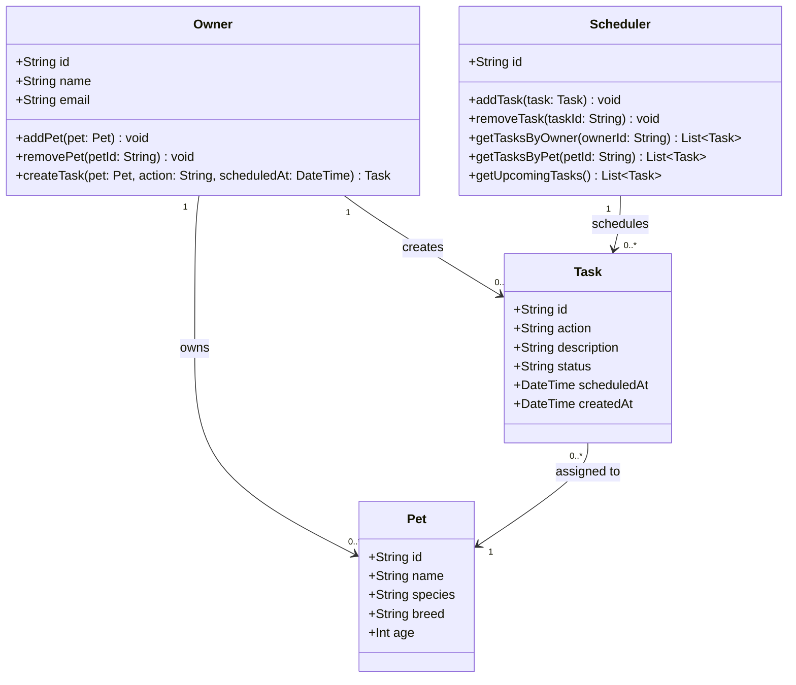

# PawPal+ UML Class Diagram

```mermaid
classDiagram
    class Pet {
        +String id
        +String name
        +String species
        +String breed
        +Int age
    }

    class Owner {
        +String id
        +String name
        +String email
        +addPet(pet: Pet) void
        +removePet(petId: String) void
        +createTask(pet: Pet, action: String, scheduledAt: DateTime) Task
    }

    class Task {
        +String id
        +String action
        +String description
        +String status
        +DateTime scheduledAt
        +DateTime createdAt
    }

    class Scheduler {
        +String id
        +addTask(task: Task) void
        +removeTask(taskId: String) void
        +getTasksByOwner(ownerId: String) List~Task~
        +getTasksByPet(petId: String) List~Task~
        +getUpcomingTasks() List~Task~
    }

    Owner "1" --> "0..*" Pet : owns
    Owner "1" --> "0..*" Task : creates
    Task "0..*" --> "1" Pet : assigned to
    Scheduler "1" --> "0..*" Task : schedules
```
